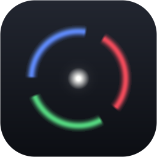

<div align="center">



# LumenDeck

**Your wallpaper is the light source.**

Live wallpapers, RGB lighting driven by what is actually on screen, and stickers
anywhere on your desktop — running natively behind your icons, on Windows.

[](https://github.com/GabrielCrackPro/lumendeck/actions/workflows/ci.yml)
[](https://github.com/GabrielCrackPro/lumendeck/releases/latest)
[](https://learn.microsoft.com/windows)

[Tauri 2](https://tauri.app) · [React 19](https://react.dev) · [Rust](https://www.rust-lang.org) · WebView2

</div>

---

## Contents

- [What it does](#what-it-does)
- [Requirements](#requirements)
- [Installing](#installing)
- [Lighting needs OpenRGB](#lighting-needs-openrgb)
- [First run](#first-run)
- [Keyboard](#keyboard)
- [Where your files live](#where-your-files-live)
- [Configuration](#configuration)
- [How it works](#how-it-works)
- [Troubleshooting](#troubleshooting)
- [Notes and limits](#notes-and-limits)
- [Development](#development)
- [Stack](#stack)
- [Further reading](#further-reading)

---

## What it does

Pick a video wallpaper. LumenDeck samples the colours off the screen ten times a
second and pushes them to your keyboard, mouse, strips and motherboard through
[OpenRGB](https://openrgb.org). Change the wallpaper and the lighting changes
with it. That is the whole idea; everything below is detail.

- **Reactive modes** — Ambient (whole-wallpaper dominant colour), Zone Sync (draw
  rectangles over the wallpaper, map each to a device), Pulse, Static
- **Animation modes** — Cycle, Wave, Breathe, and Audio Reactive, which samples
  what you are actually playing rather than guessing from the artwork
- **The wallpaper itself** — video, image, slideshow, sandboxed web page, or a
  built-in shader, attached *behind* your desktop icons via the WorkerW technique
- **Per-monitor** — override the wallpaper on any display, crossfading between
  sources
- **The OS follows too** — the static desktop background and, optionally, your
  lock screen, captured from a real decoded frame rather than a thumbnail
- **Stickers anywhere** — images, GIFs and short video, click to place, mirrored
  across all monitors, click-through where you want it
- **Scenes** — capture wallpaper plus lighting plus stickers as one look, recall
  it in a click

Everything except the lighting works with no extra software at all. A machine with
no RGB gear is a perfectly valid setup, not a broken one.

### Media it accepts

| Kind  | Formats                                                    |
| ----- | ---------------------------------------------------------- |
| Video | `.mp4` `.webm` `.mov` `.mkv`                                |
| Image | `.png` `.jpg` `.jpeg` `.gif` `.webp` `.bmp`                 |
| Other | a URL to any of the above, a folder of either, or a shader |

Codec support follows WebView2. H.264 and VP9 work out of the box; HEVC needs an
installed codec pack. A `.mkv` whose video is HEVC will import and then show
nothing, which is the codec, not the file.

---

## Requirements

### To run the app

| Requirement | Detail                                                                                       |
| ----------- | -------------------------------------------------------------------------------------------- |
| Windows     | Windows 10 or 11, x64. Stock Explorer shell — heavily modified third-party shells may fall back |
| WebView2    | Preinstalled on Windows 11. The installer fetches it if missing, which needs internet          |
| Disk        | ~100 MB for the app, plus ~21 MB if you let it fetch OpenRGB for you                         |
| Permissions | **None.** The installer is per-user and the app only writes `HKEY_CURRENT_USER`               |
| OpenRGB     | Optional. Only for RGB lighting. See [Lighting needs OpenRGB](#lighting-needs-openrgb)        |

There is no service, no driver and no administrator prompt. Uninstalling leaves
your files in `%APPDATA%/LumenDeck`; delete that folder to remove everything.

### To build it from source

| Requirement | Detail                                                                      |
| ----------- | --------------------------------------------------------------------------- |
| Node        | 22 — what CI runs. `corepack enable` if you do not already have pnpm         |
| pnpm        | 10                                                                            |
| Rust        | `stable` with the MSVC toolchain, plus Visual Studio Build Tools and the "Desktop development with C++" workload — Tauri links against the WebView2 SDK, which MSVC does not ship |
| Windows SDK | Included in the Visual Studio Build Tools install                            |

Install the build tools with
`winget install Microsoft.VisualStudio.2022.BuildTools` and add the C++ workload,
or use the full Visual Studio installer. `cargo build` failing on an unresolved
`WebView2Loader.lib` means the C++ workload is missing, not that the SDK is
absent.

---

## Installing

1. Go to the [releases page](https://github.com/GabrielCrackPro/lumendeck/releases/latest)
   and download `LumenDeck_<version>_x64-setup.exe`.
2. Run it. Windows SmartScreen may warn about an unrecognised publisher on a
   freshly built binary — the release is signed, and the signature shows as
   `GitHub Actions`. Choose **More info → Run anyway** if you trust the source.
3. Launch **LumenDeck** from the Start menu.

That is the whole installation. There is no runtime to deploy, no driver and no
second program to configure before the app is useful.

### Updates

The first updater-enabled release has to be installed by hand. After that,
LumenDeck offers updates from inside the app and installs them silently.

To skip a version, download its installer over the top — the installer replaces
the previous build and your configuration is untouched.

---

## Lighting needs OpenRGB

LumenDeck does not speak to RGB hardware directly. It talks to
[OpenRGB](https://openrgb.org), which is the piece that knows how to reach your
keyboard's controller. Nothing about wallpapers or stickers depends on this.

There are two ways to get it, and you only need one.

### Option A — let LumenDeck fetch it (easiest)

On the first-run step called **Requirements**, press **Download and start
OpenRGB**. LumenDeck downloads the pinned portable build (OpenRGB 1.0, ~21 MB),
verifies its SHA-256 against a digest compiled into the app, unpacks it under
`%APPDATA%/LumenDeck/openrgb`, and starts it with its SDK server enabled.

This is deliberately the portable zip and not the MSI: the MSI needs elevation,
and an app that pops a UAC prompt during first-run setup is asking for trust
before it has earned any. The zip is the same binaries and needs none.

On a later run the step offers **Start OpenRGB** instead, because it can see the
build is already on disk. It also shows you the exact path, since a portable
install is invisible to Windows and otherwise unfindable.

### Option B — install OpenRGB yourself

From the [OpenRGB releases](https://github.com/CalcProgrammer1/OpenRGB/releases)
or a package manager. Then:

1. Start OpenRGB.
2. Open the **SDK Server** tab and press **Start Server**. The default port is
   `6742`; LumenDeck expects that.
3. Leave it running. LumenDeck cannot start a system-wide OpenRGB install,
   because it does not know where you put it.

If you changed the port, it is not exposed in the UI — edit `rgb.port` in
`config.json` while the app is closed.

Two things worth knowing about OpenRGB itself: it needs the Microsoft Visual
C++ 2019 runtime, and on its **first run only** it wants Administrator rights so
InpOut32 can set up driver access. Run it once elevated, then never again.

### Telling whether it worked

The lighting step lists every device OpenRGB reports, with its LED count. If it
says no server, the most common cause is that the SDK server was never started —
OpenRGB runs perfectly well with it off, and nothing about its window says so.
**Retry** on that step re-reads the connection.

A server that is running but reports no devices counts as not working: it is the
state where you press Start, watch a tray icon appear, and see no lights.

---

## First run

An eight-step wizard runs once. Every step is skippable, and the app is fully
usable if you skip all of them — nothing here is a gate.

| Step | What it does                                            |
| ---- | ------------------------------------------------------- |
| 1    | Detect — reads your displays, lighting, vault and audio  |
| 2    | Requirements — install or start OpenRGB                 |
| 3    | Wallpaper — put your first one on screen                |
| 4    | Import — pull media from a file, folder or URL          |
| 5    | Lighting — confirm the devices, or skip                 |
| 6    | Mood — pick a starting lighting mode                    |
| 7    | Config — the toggles most people change                 |
| 8    | Done — a read-only receipt, then a name for the look    |

Detection only reads your machine. It reports; it does not change anything.

Setup is remembered in `general.onboarded`. To run it again, set that to `false`
in `config.json` while the app is closed.

---

## Keyboard

`Ctrl`+`K` opens the command palette. Global hotkeys for pause, next scene,
lighting mode and more are configurable, with a recorder that validates the
combination before it is saved.

---

## Where your files live

Everything is under `%APPDATA%/LumenDeck` — that is
`C:\Users\<you>\AppData\Roaming` on a default install.

| Path               | What it holds                                                       |
| ------------------ | ------------------------------------------------------------------- |
| `config.json`      | All settings. Atomic writes, schema-versioned, hot-reloaded on edit |
| `lumendeck.log`    | The log. Fixed 5 MB, one generation kept                            |
| `media/`           | Wallpapers you imported from a URL                                  |
| `thumbs/`          | Generated thumbnails, named by a hash of the source path            |
| `openrgb/`         | The portable OpenRGB build, if LumenDeck fetched it                 |
| `wallpaper-bg.jpg` | The frame used for your static desktop background                   |

OpenRGB keeps its own configuration in `%APPDATA%\OpenRGB`, separately.

Deleting the `LumenDeck` folder resets the app completely. Your original desktop
wallpaper path is stashed in `HKCU\Control Panel\Desktop` under
`LumenDeckOriginalWallpaper`.

---

## Configuration

`config.json` is hot-reloaded, so you can edit it in a text editor and the app
picks the change up without a restart.

| Group       | Controls                                                     |
| ----------- | ------------------------------------------------------------ |
| `general`   | theme, AMOLED, autostart, pause rules, accent sync, language |
| `wallpaper` | kind, source, fit, playback tuning, volume, slideshow, what an import does |
| `sticker`   | placement defaults, all-monitor mirroring                    |
| `rgb`       | mode, zones, mixer, per-device excludes, night dimming       |
| `scenes`    | named wallpaper plus lighting plus sticker profiles          |

### What an import does

The vault keeps an index of each file's resolution and length, which is what
makes sorting and filtering by them work. It is built automatically when you
import, and the **Measure on import** pill in the vault toolbar turns that off —
worth doing before dropping a few hundred files at once. The toolbar's **Index
the vault** button is always there either way.

### Import and export

**Settings → Profiles → Import and export** writes a `.json` file you can move
between machines or keep as a backup. Two kinds, and they behave differently on
the way back in:

| Export        | What is in it                                | Importing it                        |
| ------------- | -------------------------------------------- | ----------------------------------- |
| **Profiles**  | every profile                                 | **adds** them to the ones you have  |
| **Everything** | settings, vault, profiles, playlists, stickers | **replaces** all of it             |

The asymmetry is deliberate. Profiles are additive: imported ones get fresh ids
and a free name if the one they carry is taken, so nothing local can be
overwritten. A full restore replaces everything, and the confirmation says so
before it happens — export first if you want to keep what is here.

Not included either way: your log, generated thumbnails, and the OpenRGB
download, all of which are rebuilt on demand.

---

## How it works

```
  <video> decode ──> <canvas> blit ──> visible wallpaper webview
                        │
                        ├── sample the zones you drew, every 100 ms
                        │      └──> RGB engine ──> OpenRGB ──> your devices
                        │
                        └── JPEG snapshot on source change
                               └──> OS background · lock screen · fallback
```

The wallpaper window is reparented into Explorer's `WorkerW` layer, which is
what puts it behind the icons instead of behind the whole desktop. A hidden
`<video>` decodes; a canvas blits, which is what lets stickers and the UI always
composite above and gives one place to sample colour from.

The blit loop caps itself to the source's frame rate — a 24 fps wallpaper does
roughly half the canvas work of a naive 60 fps loop, with no visible difference.

Full details, including the threading model and the config schema, are in
[`docs/architecture.md`](docs/architecture.md).

---

## Troubleshooting

**Nothing appears behind my desktop icons.** Stock Explorer works. Modified
shells may not expose a usable `WorkerW` handle; the app falls back to a
bottom-anchored window and says so on the Wallpaper tab.

**Lighting says "no OpenRGB server".** OpenRGB is not running, or its SDK server
was never started. OpenRGB runs fine with the server off and nothing about its
window indicates that — check the **SDK Server** tab.

**Lighting says "no lighting found" but OpenRGB is running.** The server answered
with an empty device list. Either nothing is attached, or OpenRGB cannot see it,
which is often the case for a device another vendor's app is holding.

**LumenDeck sees no devices where OpenRGB sees several.** Devices claimed by
another RGB application do not appear. Close the vendor app.

**A video imports but shows nothing.** Codec. Check the file plays in a browser;
HEVC needs a codec pack WebView2 does not include.

**The installer warns about an unknown publisher.** SmartScreen on a newly
published signed binary. The signature is `GitHub Actions`.

**Autostart did nothing.** Check **Settings → General → Launch at startup**, and
confirm it is on and not blocked in Task Manager's Startup apps tab.

**The updater never offers anything.** You are on the first updater-enabled
release, which has to be installed by hand.

**Reporting a bug.** `%APPDATA%/LumenDeck/lumendeck.log` is what support needs.
Set `RUST_LOG=lumendeck=debug` before launching for per-tick detail.

---

## Notes and limits

- WorkerW attach works on stock Windows 10 and 11 shells. Heavily modified shells
  may fall back to a bottom-anchored window; the app tells you when it does.
- Codec support follows WebView2. H.264 and VP9 work out of the box; HEVC depends
  on installed codec packs. There is a software-decode fallback for GPUs that
  struggle with 4K H.264 in the hardware pipeline.
- `media://` serves media files only, from folders you chose in the app. It is not
  a general filesystem reader.
- OpenRGB's hardware access is reverse-engineered and has damaged hardware in the
  wild; the MSI Mystic Light code is disabled upstream for that reason.
- WinRT toast notifications are implemented but not yet verified end to end.
- The dashboard needs the Tauri shell to run. It will not start in a plain
  browser, because the window APIs have no IPC host to talk to — use
  `pnpm app:dev`.

---

## Development

```bash
pnpm install
pnpm app:dev                      # the real app
node scripts/verify.mjs           # everything CI runs, in CI's order
node scripts/verify.mjs --no-build # skip the production bundle
```

Individual checks:

```bash
npx tsc --noEmit                   # types
npx vitest run                     # frontend logic
cd src-tauri && cargo test         # Rust
node scripts/i18n-check.mjs        # locale catalogs
node scripts/check-versions.mjs    # version files agree
```

CI runs every check above on each push and pull request, and publishes a signed
NSIS installer after a successful push to `main`. Add `[skip release]` on a line
of its own to a commit message to run every check and publish nothing — useful
for a documentation or CI change that has no business spending a version number.

---

## Stack

| Layer     | Choice                                                         |
| --------- | -------------------------------------------------------------- |
| Shell     | Tauri 2 (Rust) + WebView2                                      |
| UI        | React 19, TypeScript strict, Tailwind CSS 4, Zustand          |
| Win32     | `windows` crate — WorkerW, click-through, monitors, input hooks |
| RGB       | [`openrgb`](https://crates.io/crates/openrgb) SDK client       |
| Media     | custom `media://` protocol, path-safe and extension-allowlisted |
| Logging   | `tauri-plugin-log`, fixed 5 MB file, `RUST_LOG` override        |
| Quality   | vitest, `cargo test`, `i18n-check`, `check-versions`, CI       |
| Packaging | NSIS installer, published by GitHub Actions on `main`           |

---

## Further reading

| Document                                        | What it is for                                                  |
| ----------------------------------------------- | --------------------------------------------------------------- |
| [`AGENTS.md`](AGENTS.md)                        | Conventions and hard rules. Entry point for contributors and coding agents |
| [`docs/architecture.md`](docs/architecture.md)  | How the pieces fit, and why the shapes are what they are         |
| [`docs/development.md`](docs/development.md)    | Step-by-step recipes for the changes that come up repeatedly    |
| [`docs/design.md`](docs/design.md)              | Tokens, primitives and motion — the reference for any UI change |
